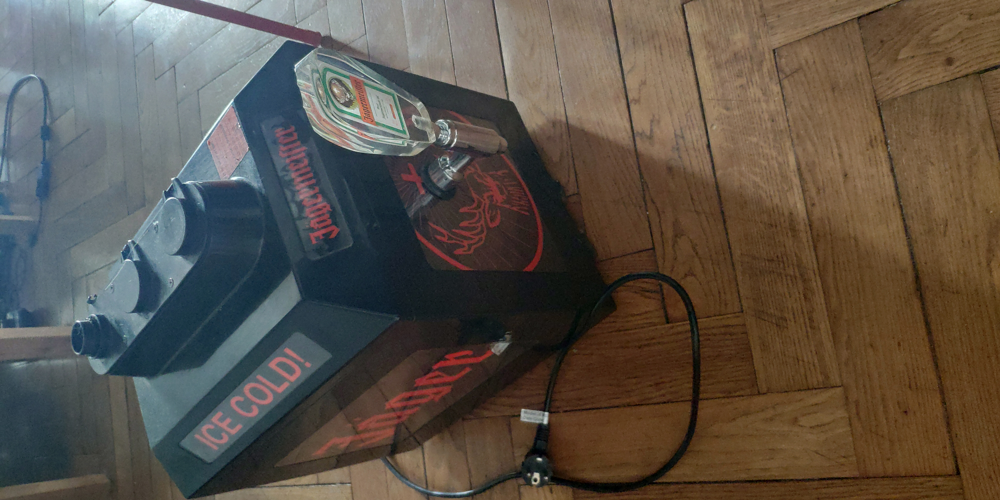
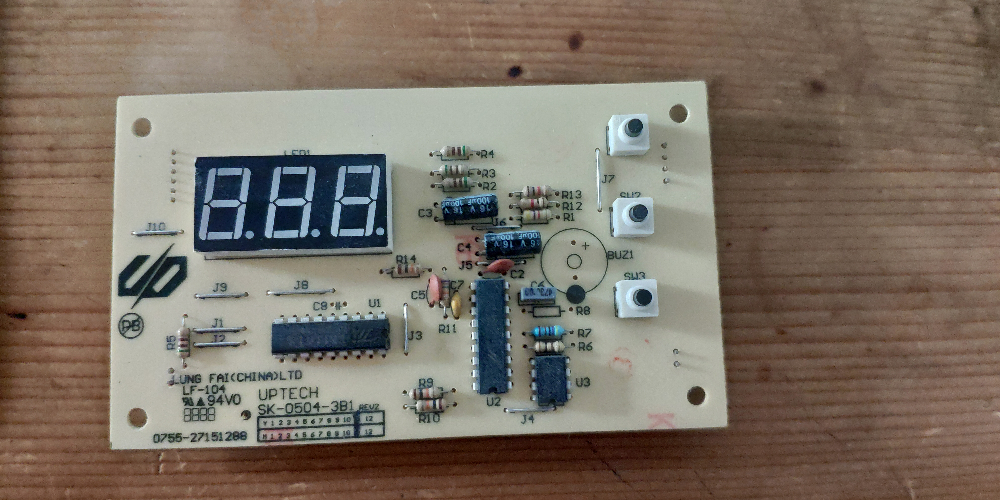
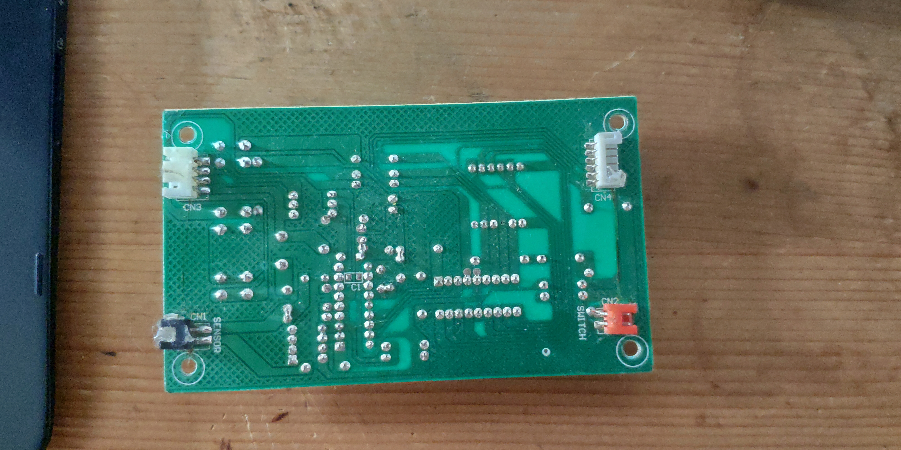

# Jagermeister Tap Machine

This project is a restoration of an old professional Jagermeister Tap Machine.  

  

This machine was aquired by a friend of mine who get it from a barman friend of him that had the no more working machine in his back shop as he didn't known what was the problem and by a new one as this one was old.  

# Description of the machine

The machine is a cooler for JAGERMEISTER that bring the liquid temperature to -17°C to -19°C (adjustable on the controller).  
To cool the liquid, the machine use a refrigerator compressor which produce heat in return.  
The heat is then disipated by a big fan at the back of the machine.  

On the electronic side, the machine is made of 2 parts : the power distribution and the controller.  

The power distribution is the part where the 220V is converted to 2.2V for the leds on the outside and to 15V for the controller.  
There is also 2 big relay to control the compressor and the fan that are in 220V.  

  

The controller side is the brain of the machine.  
It is connected to a temperature sensor, a liquid detector (detect if there is more than 425ml in the pipes), a 1 digit 7-Segments display, a 3 digit display for temperature adjustment.  
The controller enable the compressor and the fan when the liquid is detected and if the temperature is too high, and stop when the temperature is good.  
It display a "L" on the frond display when liquid is to low and a "F" when it is ok.  

  

  

# The problem of the machine

After some time of analyses with a multimeter, if found that the power side was ok but the machine refuse do work, except for the external leds, which are directly connected to the power card.  
The probleme was the controller who seemed to be dead. But i wasn't able to find what components were involved.  
I so thinked about buying a new controller card but as it was an old European model, no pieces were availables.  
So I decides to build my own controller with an Arduino Nano !  

  

  

# The new controller

The new Arduino based controller follow the same behaviour than the old original one with some new features and maybe some missing features, but unsure about the existence of these features.  

One new feature is a visual signal for when the liquid is cooling.  
As the machine is originaly made for professional, it is made to be working everyday and every time (with a recommended cleaning every 3 month).  
Also, as the machine has a tank of approximatively 2 liter and can handle 3 bottles of 1 liter on the top, there is constantly a big quantity of liquid to cool and the temperature varies little.  
In my usage, it is exceptional when there is 2 liter in the machine, so i need to know when the machine is cooling or not and not only from the sound of the fan.  

As the Arduino Nano does not have a memory to store data from the code when it is off, I was not able to add the temperature adjustment feature.  

A complicated part was the powering of the Arduino. Normally, the Arduino Nano need 5V and at least 19mA, but as said before, the power side was only making 2.2V and 15V.  
I finally try to power the Arduino with the 15V on the Vin pin, which normally take 7 to 12V and convert it to 5V, but that can in fact take 6 to 20V (7 to 12V is the working assurance range).  
It worked fine, even if, normally again, the 15V output was limited to 10mA.  
But if I am not wrong and with P = U x I, at 5V, it should be able to deliver 30mA.  

Finally, the new controler card is the same size as the old original and had the different connectors at the same positions so it fit the original case.  

  

# Planned improvements

One thing that I mention earlier was that the machine is a professional one made for big volume and permanent use. But I am not a professional and rarely put more than 1 liter inside.  
There is also the fact that the compressor do not really cool the liquid but a gaz, that then cool the liquid .  
But as the gaz is cooled faster than the liquid, when the compressor stop, the gaz continue to cool the liquid.
It cause that the liquid sometime freeze inside from beeing cooled to much.  

A way to fix this could be to compute the cooling speed and to anticipate when to stop.  
This is the only way as it is impossible to set the cooling speed or to know the exact liquid quantity.  

Another upgrade would be to replace the current Arduino Nano by an ESP8266 NodeMCU.  
The ESP8266 is a way more powerful, have integrated Wifi and Bluetooth, and have a memory chip that can be used from the code to store data between reboots.  
This will allow to remotly set some parameters like the desired minimum temperature (that change with the alcool degree) and to store the information in the memory.

A last upgrade would be to replace the manual tap by a solenoid valve to dispense an exact amount for a dose.  
This might need some experimentations as the liquid become more viscous as it cool down.

# Random photos

  
I used an external Serial<->USB connector to monitor the program states as the Arduino was already externaly powered and only connect GND, RX and TX.  